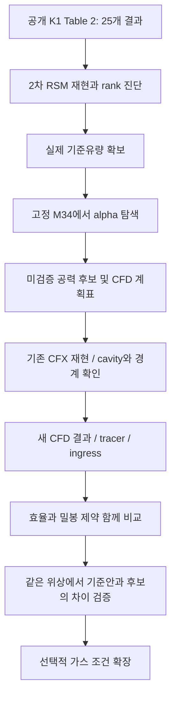

# 면담에서 실제 연구로 이어지는 설계

## 연구 질문
같은 ③④ 공기량을 사용할 때, 허브/슈라우드 배분을 바꾸면 공력 성능과 유입 지표가 어떻게 달라지는가?
①②⑤⑥은 없애는 것이 아니라 고정한다. ③④만으로 전체 최적성을 주장하지 않는다.

A/B/D/E의 수치 분석과 보고서가 현재 코드다. F 이후의 물리해석은 수행하지 않았다.

## 처음 받아야 할 자료

- 원논문 재실행 가능한 계산환경과 데이터 사용·공개 허가. 공저자 자료가 자동으로 사용 가능하다고 가정하지 않는다.
- m3,0 및 m4,0와 유량 기준: 전주 유량인지 sector 유량인지. 같은 기준으로 환산한 값만 합한다.
- 원래 material, 입구 전압/전온 분포, 출구 조건, 벽면 모델, 회전수, 물성, mesh/interface 설정.
- cavity가 유입을 계산할 수 있을 만큼 포함되는지, 퍼지 경계가 실제 rim 입출구를 막는 위치인지.
- ε 측정/검증 자료, tracer 출처 정의, 실제 부품의 허용 기준을 확보할 수 있는지.

## CFD 결과 양식

- case_id: 개별 계산 이름. allocation_id: 배분안 식별자.
- context_id: 가스·열역학 상태·회전수·압력 조건 등 물리조건 전체를 식별한다.
- phase_id/mesh_id: 위상과 격자. 서로 다른 조건을 같은 것으로 표기하면 비교가 성립하지 않는다.
- reference_id: Δη와 Δ토크의 기준. 원논문은 no-leakage 기준이다.
- delta_eta_pp: fraction 효율 차이에 100을 곱한 percentage-point 값. 절대 효율을 그대로 넣지 않는다.
- delta_torque_nm: 원논문과 동일한 동익 한 개 기준. 모르는 값은 빈 칸.
- sealing_effectiveness: 정해진 평가위치·평균법·tracer 정의로 얻은 값. 정의를 실험기록에 남긴다.
- ingress_kg_s: 내부 rim 면의 gross inward flux. net flow와 혼동하지 않는다.
- status=pending/completed, origin=not_run/cfd, role=unassigned/holdout/verification.
  origin=cfd는 실제로 계산한 경우에만 입력한다.

표본에 쓰인 위치를 다시 계산한 값은 verification이다. 새로운 위치의 확인용 계산을 holdout으로 둔다.
후속 학습에 사용하면 더 이상 독립 holdout이 아니다. 현재 코드는 관측값을 자동 재학습하지 않는다.

## 제약을 추가할 때

현재 공력 RSM에서 ε를 유추하지 않는다. 실제 스칼라 결과가 없다면 sealing unknown이다.
③을 줄이는 경우 바깥쪽 보호 성능의 저하도 확인해야 한다. ④ 캐비티만 좋아졌다고 전체 설계가 안전한 것은 아니다.
ε=0.8/0.95 같은 임계값을 실제 부품 안전기준인 것처럼 임의로 정하지 않는다.
실제 기준이 없다면 성능-ε 관계와 요구치 민감도까지만 보고한다.

## 비교 방식

같은 gas/phase/mesh에서 후보-기준의 차이를 먼저 구한다.
격자·수렴 기준을 바꿀 때도 이 차이의 변화량을 확인한다.
서로 다른 frozen-rotor 위상들의 절대값 산포를 수치적 랜덤 노이즈로 취급하지 않는다.
몇 개 위상에 대해 우열이 유지돼도 unsteady ingress를 검증한 것은 아니다.

수소는 다음 단계다. 동일 TIT에서 조성 효과를, TIT까지 바꾸면 운전 시나리오 효과를 본다고 구분한다.
초기 물성 차이가 작다는 것만으로 ε 차이가 없다고 확정하지도, 신호를 키우려 근거 없는 TIT를 선택하지도 않는다.
Tang IWM은 무계수 보편 진리나 K1의 검증된 대체품이 아니다. 수식·보정자료·적용 범위를 먼저 확보한다.

## 4~6주 범위

1주: 기존 CFD와 데이터 권한, 실제 유량, 모델/평가면 확인.
2주: tracer/ingress 정의 및 후보 위치 선정.
3주: 제한된 배분 조건 계산, 실제 공력-밀봉 응답.
4주: 후보/기준의 paired 비교, 보고서. 여기까지 최소 본체.
5~6주: 격자/상대위치 민감도 검증. 자원이 남으면 총량 또는 가스 확장 중 하나만 선택.

수소, total-budget 변화, 네 유로 동시 최적화, 새 full-annulus URANS를 동시에 목표로 잡지 않는다.
현재 PoC는 사전 준비이고, 허용된 CFD 환경을 받지 못하면 원래 4~6주 물리 연구는 별도 재설계가 필요하다.
